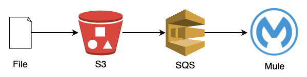
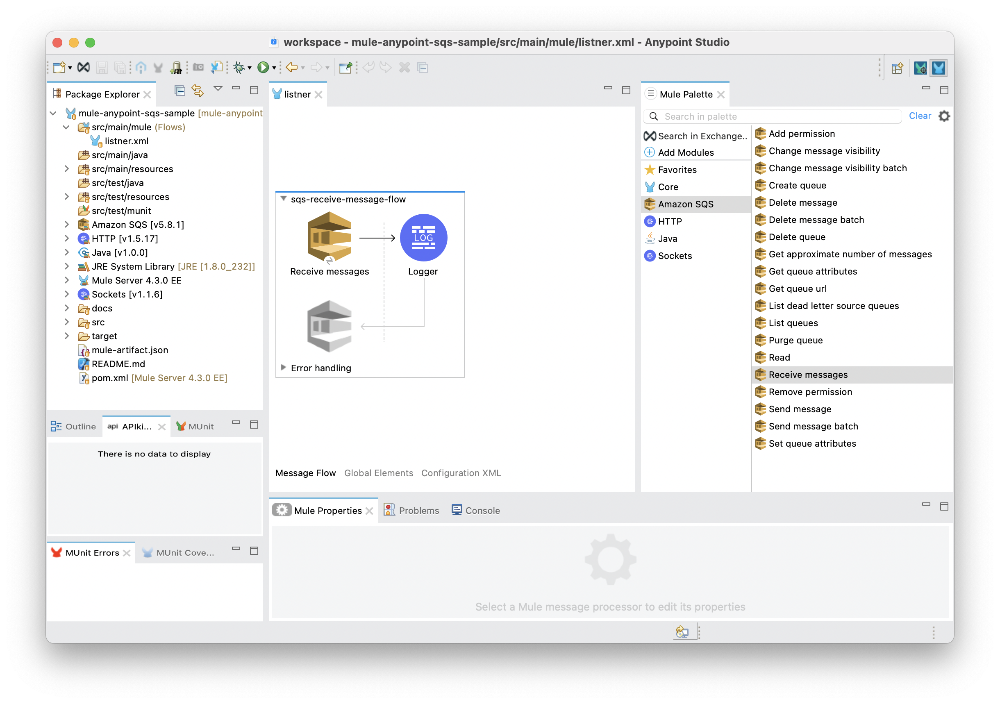

# Mule Anypoint SQS Sample

This project demonstrates how Mule receives notification when S3 bucket has been created or deleted on AWS through SQS.





## Requirements

- [Anypoint Studio](https://docs.mulesoft.com/studio/7.6/to-download-and-install-studio)
- [AWS](https://aws.amazon.com)

## Reference

- https://docs.mulesoft.com/amazon-sqs-connector/5.8/amazon-sqs-connector-studio

## Preparations

Note: In this instruction, I set Queue name as `s3-event-queue` and S3 bucket name as `mule-anypoint-sqs-sample-bucket`, you can change any name as you wish, however, please make sure to replace the part in the following sample policy with yours.

1. Go to AWS SQS console and create a **Standard Queue** with the following Access policy and obtain `SQS URL`:

    ```json
    {
      "Version": "2012-10-17",
      "Id": "arn:aws:sqs:us-east-1:000000000000:s3-event-queue/SQSDefaultPolicy",
      "Statement": [
        {
          "Sid": "Sid000000000000",
          "Effect": "Allow",
          "Principal": {
            "AWS": "*"
          },
          "Action": "SQS:SendMessage",
          "Resource": "arn:aws:sqs:us-east-1:000000000000:s3-event-queue",
          "Condition": {
            "ArnLike": {
              "aws:SourceArn": "arn:aws:s3:*:*:mule-anypoint-sqs-sample-bucket"
            }
          }
        }
      ]
    }
    ```

    Leave the default for the maximum message size, visibility to other consumers, and message retention etc.

    Please make sure NOT to select **FIFO Queues** as it is not supported for S3 event

2. Go to AWS S3 Console and create a bucket and set Event notifications to point to the SQS queue you created above

    Event name can be anything, set `All object create events` and `All object delete events` for Event types

3. Go to AWS IAM console and and generate `access key` and `secret key` by creating an IAM user with `AWSLambdaSQSQueueExecutionRole` policy like below:

    ```json
    {
      "Version": "2012-10-17",
      "Statement": [
        {
          "Effect": "Allow",
          "Action": [
            "sqs:ReceiveMessage",
            "sqs:DeleteMessage",
            "sqs:GetQueueAttributes",
            "logs:CreateLogGroup",
            "logs:CreateLogStream",
            "logs:PutLogEvents"
          ],
          "Resource": "*"
        }
      ]
    }
    ```

## Environment Variables

Update `src/main/resources/properties.yaml` based on the information you created above steps

## Open Project

1. Open **Anypoint** App
2. Select **File** > **Import**
3. Select **Anypoint Studio/Anypoint Studio project from File System** and Click **Next >** button
4. Provide the `Project Root` and deselect **Copy project into workspace** option so you can update the code directory on the folder you specified and Click **Finish >** button

## Run and Execute

1. Right-click within the Anypoint Studio canvas and selecting **Run project mule-anypoint-sample**

    Note: Alternatively, you can click the **Run button** located at the top of Anypoint Studio, and select **mule-anypoint-sample** from the drop-down menu that opens.

2. Upload some file into the S3 bucket you created

3. Check console log on Anypoint Studio
